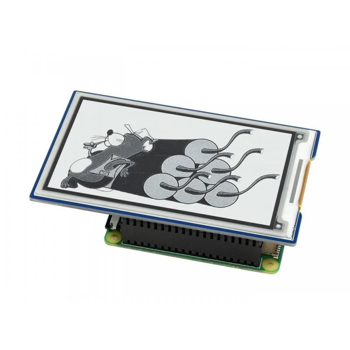

# bosch-dishwasher-control, or 'MQTT at home, for Fun And Profit!'

This repo contains the code take [MQTT](https://mqtt.org/) messages from my Bosch dishwasher and 
uses them to update an [ePaper sign](https://thepihut.com/products/3-7-e-ink-display-hat-for-raspberry-pi-480x280)
attached to a Raspberry Pi. I did it because the dishwasher doesn't tell you when it 
going to finish on its display. There's an [app](https://www.home-connect.com/ie/en/), but that means all messages to and from the dishwasher have to 
go through a cloud data center somewhere, even though I am standing two feet away from it. In practice the app is almost more trouble than it's worth, as it takes about 60 
seconds to connect each time. This way anyone in the house can tell when it's going to finish.

## My dishwasher uses MQTT? Really?

Yes, really. 
The [API](https://api-docs.home-connect.com/programs-and-options/#dishwasher) is public. 

But you still have to have appropriate privs to access the dishwasher, as unlike most consumer IOT companies Bosch takes security seriously.

## Someone has already done a *ton* of work on this, so I used that...

There's a useful project called [hcpy](https://github.com/hcpy2-0/hcpy). HCPY has solved the really tricky part of this, which is getting Bosch to give you
the credentials for the dishwasher and then telling it to send MQTT messages to a local IP.

I did my own fork (called [hcpy-hacked](https://github.com/srmadscience/hcpy-hacked) ). 
The [changes](https://github.com/srmadscience/hcpy-hacked/commit/ce5798fe9dd56af76dad954cd5c306f8ce91b3e1) 
are trivial, and involve writing values we care about to files every time we see them:

````
    interesting_ones = ['BSH.Common.Option.ProgramProgress',
                            'BSH.Common.Option.RemainingProgramTime',
                            'BSH.Common.Status.Program.All.Count.Started',
                            'Dishcare.Dishwasher.Status.ProgramPhase',
                            'BSH.Common.Root.SelectedProgram',
                            'BSH.Common.Status.OperationState',
                            'BSH.Common.Option.StartInRelative',
                            'deviceID']
````

and

````
 for key, value in values.items():
              if key in interesting_ones:
                    print("FOUND:" + key + ":"+ str(value) + "\n")
                    f = open('BSH_' + "_"+ key + '.dat', 'w', encoding="utf-8")
                    f.write(f'{str(value)}\n')
                    f.flush()
                    f.close()
````
While bordering on the silly, doing this makes life much simpler. I don't need a Dishwasher emulator to do development.

## You'll need to run MQTT...

One thing that hcpy doesn't eally mention is that you need an MQTT server. I used 
[mosquitto](https://mosquitto.org/download/)

## Finding a display to use...

I went to [PiHut](https://thepihut.com) and found a [3.7 inch ePaper display](https://thepihut.com/products/3-7-e-ink-display-hat-for-raspberry-pi-480x280)
 that fits on the extension pins:



The [documentation](https://www.waveshare.com/wiki/3.7inch_e-Paper_HAT_Manual#Working_With_Raspberry_Pi) is pretty good, and I was able to find the code I needed easily.

## Turning the MQTT data into something I can put on a sign...

The MQTT messages arrive at regular intervals, but not all the data arrives in the same message. This is one reason I opted for writing each data item to its own file.
The messages are not intended to be dumped onto a display, especially one with limited real estate. Most of the [code](update_sign.py) is for:

* Wrangling the data into a form we can use, such as turning 'seconds to completion' into an actual *time*.
* Deciding what to print and when
* Only printing messages when something has changed - ePaper doesn't like escessive updates
* Handling the weird voodoo associated with writing to the sign


## Next Steps and Things I Noticed

### Under the covers Bosch are using minutes, and then turning them into seconds

This causes problems when you take 'time remaining' and add it to 'now', as time remaining is only accurate to 60 seconds. Your end date ends up flipping back and forth between two values.

### In an ideal world I wouldn't need HCPY once I was running.

Issue is that it's real value is in persuading your appliance to send MQTT messagges, and if you copied all the needed functionality you'd end up replicating the entire project. So my hacked version is asinine, but it *works*.

